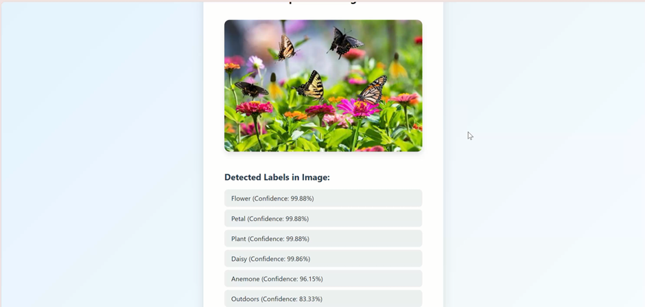

# 🔍 AWS Rekognition Object Detection App

This project is a web application that detects and classifies objects in images using **Amazon Rekognition**. Users can upload an image, and the app will analyze its content in real-time using AWS Rekognition's powerful deep learning models.

---

## 📸 Features

- Upload images via a simple frontend
- Real-time object and label detection using Amazon Rekognition
- Displays image with detected labels and confidence scores
- Built with **Node.js**, **Express**, **Multer**, **EJS**, and **AWS SDK**

---

## 🛠 Tech Stack

- **Frontend:** HTML, CSS, EJS
- **Backend:** Node.js, Express.js
- **Image Upload:** Multer
- **Cloud Service:** AWS Rekognition
- **Others:** dotenv for environment variables

---

## 📁 Project Structure
```bash
aws-image-recognition-app/
│
├── public/ 
│ └── uploads/
│
├── views/
│ └── index.ejs
│
├── .env 
├── .gitignore
├── package.json
├── app.js 
```
---

## 🚀 Getting Started

### 1. Clone the repository

```bash
git clone https://github.com/your-username/aws-image-recognition-app.git
cd aws-image-recognition-app
```

### 2. Install dependencies
```bash
npm install
```

### 3. Set up environment variables

Create a .env file in the root folder and add your AWS credentials:
```bash
AWS_ACCESS_KEY_ID=your_access_key
AWS_SECRET_ACCESS_KEY=your_secret_key
AWS_REGION=ap-southeast-1
```
⚠️ Make sure .env is listed in .gitignore to avoid exposing credentials.

### 4. Run the app locally
```bash
node app.js
```
Visit http://localhost:3000 in your browser.

---
### Live Demo


---

🧠 Use Cases
Surveillance and Security Systems

Smart Retail Monitoring

Safety & Compliance Detection

AI-Powered Photo Tagging

---

📜 License
This project is licensed under the MIT License.

---
